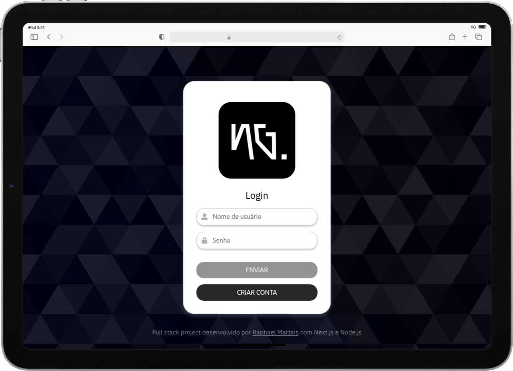
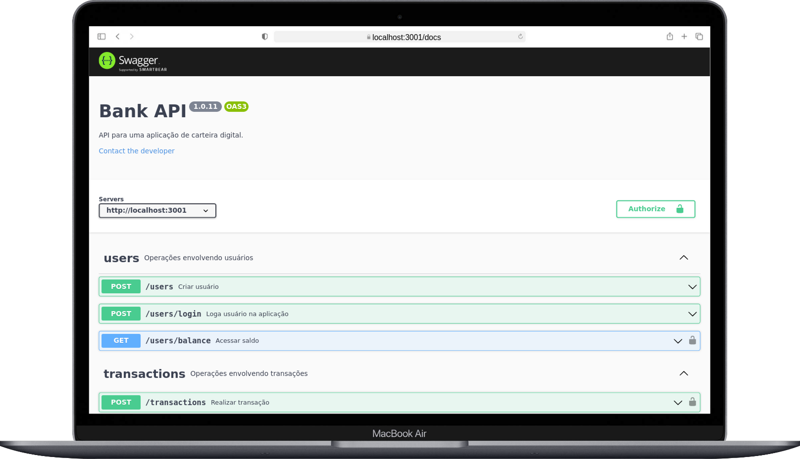
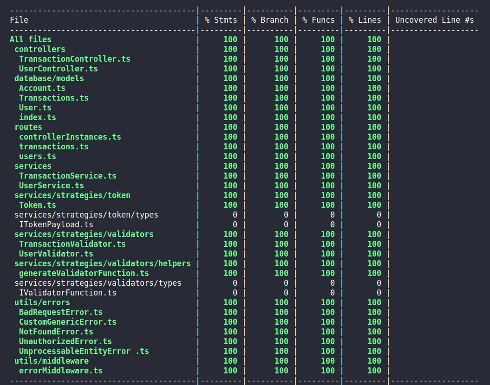
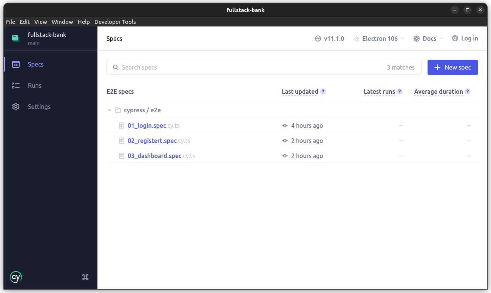
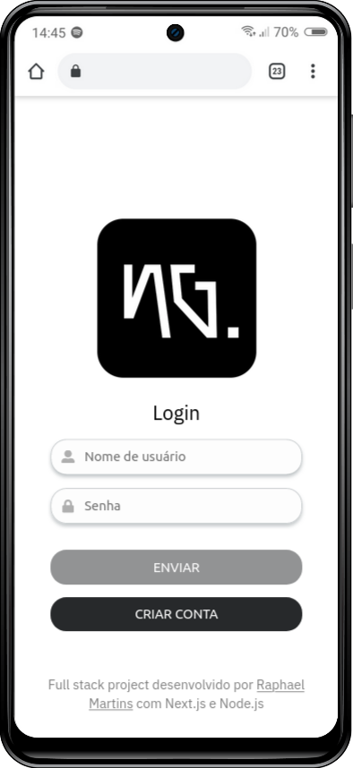
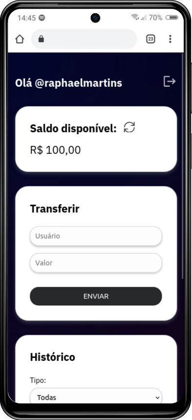
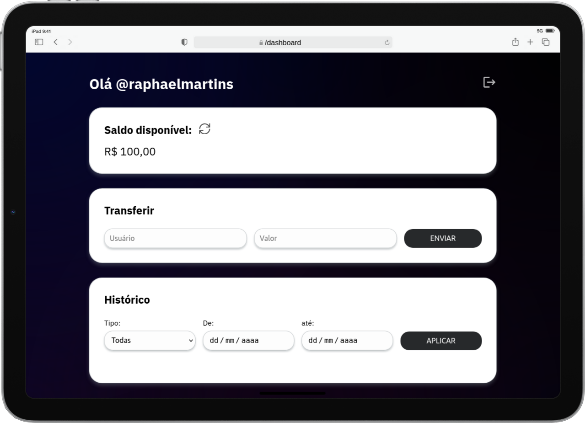

# :coin: Full Stack Bank :dollar:



## :page_with_curl: About/Sobre

<details>
  <summary markdown="span"><strong>:us: English</strong></summary><br />

Full stack digital wallet application developed in Next.js and Node.js with TypeScript and built with Docker.

**Note:** the application is currently only in Brazilian Portuguese, I want to add an English translation soon.
<br />
</details>

<details>
  <summary markdown="span"><strong>:brazil: Português</strong></summary><br />

Aplicação full stack dockerizada de carteira digital desenvolvida em Next.js e Node.js com TypeScript.
<br />
</details>

## :man_technologist: Developed Skills//Habilidades desenvolvidas

<details>
  <summary markdown="span"><strong>:us: English</strong></summary><br />

* Develop a frontend application with the Netx.js framework and TypeScript
* Use Sass and CSS Modules for frontend styling
* Develop a RESTful API in Node.js with Express.js and TypeScript
* Use an ORM
* Use a PostgreSQL database
* Document the API with Open API and the Swagger UI framework
* Implement backend integration tests using Mocha.js, Chai.js and Sinon.js with 100% coverage
* implement E2E tests with the Cypress framework in conjunction with the Testing Library
* Dockerize the application using Docker Compose
<br />
</details>

<details>
  <summary markdown="span"><strong>:brazil: Português</strong></summary><br />

* Desenvolver uma aplicação frontend com o framework Netx.js e TypeScript
* Utilizar Sass e CSS Modules para a estilização do frontend
* Desenvolver uma API RESTful em Node.js com Express.js e TypeScript
* Utilizar um ORM
* Utilizar um banco de dados PostgreSQL
* Documentar a API com Open API e o framework Swagger UI
* Implementar testes de integração no backend utilizando Mocha.js, Chai.js e Sinon.js com 100% de cobertura
* mplementar testes E2E com o framework Cypress em conjunto com a Testing Library
* Dockerizar a aplicação utilizando Docker Compose
<br />
</details>

## :memo: Methodologies and paradigms/Metodologias e paradigmas

<details>
  <summary markdown="span"><strong>:us: English</strong></summary><br />

* Mobile First
* BEM (Block-Element-Modifier) ​​in CSS
* Object-Oriented Programming (OOP)
* SOLID Principles
<br />
</details>

<details>
  <summary markdown="span"><strong>:brazil: Português</strong></summary><br />

* Mobile First
* Padrão BEM (Block-Element-Modifier) no CSS
* Programação Orientada a Objetos (POO)
* Princípios de SOLID
<br />
</details>

## :hammer_and_wrench: Stacks

* TypeScript
* React.js
* Next.js
* Sass
* Cypress
* Testing Library
* Node.js
* Express.js
* Sequelize.js
* PortgreSQL
* Swagger UI
* Mocha.js
* Chai.js
* Sinon.js
* Docker
* Docker Compose

## :hammer_and_wrench: Installation and execution/Instalação e execução

<details>
  <summary markdown="span"><strong>:us: English</strong></summary><br />

To run this application you need to have **Git**, **Docker**, **Node** and **Docker Compose** installed on your computer. Docker Compose needs to be version **2.5.0** or higher and Node version **16**.

In addition, to run the step-by-step commands below, your operating system must also have a **Bash terminal** installed. If you are using **Linux** or **macOS**, Bash is already installed by default. However, if your system is **Windows**, you may need to do [separate installation](https://www.lifewire.com/install-bash-on-windows-10-4101773).

### 1. In the project root directory, run the command below in the terminal to install the dependencies

```sh
npm install
```

### 2. Start the application containers

```sh
npm run compose:up
```

By running the command above, three containers will be started:

* ng_frontend - mapped on the port 3000
* ng_backend - mapped on the port 3001
* ng_db - mapped on the port 3002

They are the front-end, back-end and the database, respectively. After the containers starts, you can enter the <http://localhost:3000> address in your browser to see the application running.

To stop the containers, run the command below:

```sh
npm run compose:down
```

<br />
</details>

<details>
  <summary markdown="span"><strong>:brazil: Português</strong></summary><br />

Para rodar está aplicação é necessário ter **Git**, **Docker**, **Node** e o **Docker Compose** instalados no seu computador. O Docker Compose precisa estar na versão **2.5.0** ou superior e o Node na versão **16**.

Além disso, para executar os comandos do passo-a-passo abaixo também é necessário que o seu sistema operacional tenha um **terminal Bash** instalado. Caso você esteja utilizando **Linux** ou **macOS**, o Bash já vem instalado por padrão. Porém, se o seu sistema for **Windows**, talvez você precise fazer [a instalação a parte](https://www.lifewire.com/install-bash-on-windows-10-4101773).

### 1. No diretório raiz do projeto, execute o comando baixo no terminal para instalar as dependências

```sh
npm install
```

### 2. Suba os containers da aplicação

```sh
npm run compose:up
```

Executando o comando acima, será criada uma rede de três containers:

* ng_frontend - mapeado na porta 3000
* ng_backend - mapeado na porta 3001
* ng_db - mapeado na pa porta 3002

Se tratam da aplicação frontend, backend e o banco de dados, respectivamente. Depois que eles estiverem rodando, basta acessar o endereço <http://localhost:3000> no seu navegador para utilizar a aplicação.

Para parar os containers, utilize o comando:

```sh
npm run compose:down
```

<br />
</details>

## :books: API Documentation/Documentação da API

<details>
  <summary markdown="span"><strong>:us: English</strong></summary><br />

With the application running, access the <http://localhost:3001/docs> address in your browser to see the API documentation implemented with Swagger UI.
<br />
</details>

<details>
  <summary markdown="span"><strong>:brazil: Português</strong></summary><br />

Com a aplicação em execução, basta acessar o endereço <http://localhost:3001/docs> no seu navegador para visualizar a documentação implementada com o Swagger UI.
<br />
</details>



## :test_tube: Tests/Testes

### Integration/Integração

<details>
  <summary markdown="span"><strong>:us: English</strong></summary><br />

I've implemented backend integration tests with 100% coverage. To check their result, just run the command below in the project root directory:

```sh
npm run test: integration
```

**Note:** to run the integration tests, it is not necessary for the application to be running, as the interaction with the database is mocked and the tests start an instance of the API before being started.
<br />
</details>

<details>
  <summary markdown="span"><strong>:brazil: Português</strong></summary><br />

Implementei testes de integração no backend com 100% de cobertura. Para verificar o resultado deles, basta executar o comando abaixo na raiz do projeto:

```sh
npm run test:integration
```

**Observação:** para rodar os testes de integração, não é necessário que a aplicação esteja rodando, pois a interação com o banco de dados é mockada e os testes iniciam uma instância da API antes de serem iniciados.
<br />
</details>



### E2E (End-to-End)

<details>
  <summary markdown="span"><strong>:us: English</strong></summary><br />

I've also implemented some E2E tests with the Cypress framework in conjunction with the Testing Library to use semantic selectors. **Applications must be running** before running E2E tests.

To open Cypress in the browser, run the command in the project root directory:

```sh
npm run test:e2e:open
```

A window will open with the list of specs, just click one of them to start the tests.

If you prefer, it is also possible to run the E2E tests without the graphical interface by using the command below:

```sh
npm run test:e2e
```

<br />
</details>

<details>
  <summary markdown="span"><strong>:brazil: Português</strong></summary><br />

Também implementei alguns testes E2E com o framework Cypress em conjunto com a Testing Library para utilizar seletores semânticos. **É necessário que as aplicações estejam sendo executadas** antes de rodar os testes E2E.

Para abrir o Cypress no navegador, execute o comando na raiz do projeto:

```sh
npm run test:e2e:open
```

Será aberta uma janela com a lista das specs, basta clicar em alguma delas para que os testes sejam iniciados.

Caso prefira, também é possível rodar os testes E2E sem a interface gráfica utilizando o comando:

```sh
npm run test:e2e
```

<br />
</details>



### Run all tests/Executar todos os testes

<details>
  <summary markdown="span"><strong>:us: English</strong></summary><br />

Run the command below in the project root directory tp run all integration and E2E tests in sequence in your terminal:

```sh
npm run test
```

**Note:** this command runs the E2E tests without the graphic interface.
<br />
</details>

<details>
  <summary markdown="span"><strong>:brazil: Português</strong></summary><br />

Rode o comando abaixo na raiz do projeto para rodar todos os testes de integração e E2d em sequência no terminal:

```sh
npm run test
```

**Observação:** esse comando roda os testes E2E sem a interface gráfica.
<br />
</details>

## :iphone: Screenshots/Capturas de tela





